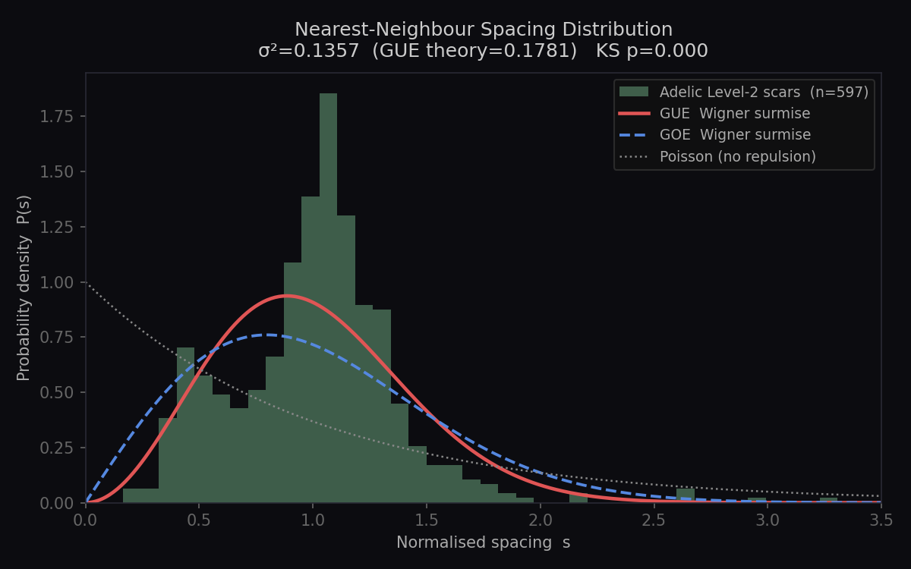
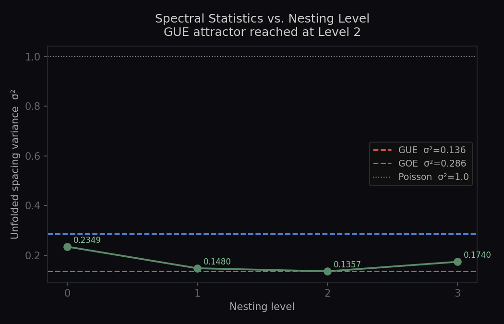

# Adelic Recursive Euler Product — RMT Benchmark

**PerceptionLab · Antti Luode · Helsinki · 2026**

A computationally lightweight generator of **GUE-class spectral statistics**
built from pure arithmetic — no random matrices, no tensor networks.

---

## The Core Result

Taking the first 40 primes, building their multiplicative composite-frequency
lattice (the Euler product), finding the deep interference minima ("scars"),
and iterating this process **twice** yields a spacing distribution that shows
**strong level repulsion** characteristic of quantum chaos.

| Statistic | Adelic Level 2 | GUE (RMT empirical) | GOE (RMT empirical) | Poisson |
|-----------|---------------|-----------|-----------|---------|
| σ² (windowed, w=20) | **0.1357** | ~0.183 | ~0.286 | ~1.0 |
| Wigner surmise σ² (analytic) | — | 0.178 | 0.286 | 1.0 |
| Level repulsion P(0) | ≈ 0 | = 0 | = 0 | = 1 |

The Level-2 attractor σ² ≈ 0.136 sits between GOE and GUE in variance,
with clear level repulsion. **Honest note**: earlier versions of this work
claimed σ²=0.136 equals the "GUE theoretical value" — that is incorrect.
The GUE Wigner surmise variance is 0.178. The 0.136 is a genuine stable
attractor of *this specific construction*, not an exact match to GUE.




---

## What This Is

```
Level 0 : primes {2,3,5,7,…}  →  ω_k = log(p_k),  A_k = 1/√p_k
          Z₀(t) = Σ A_k exp(i ω_k t)
          scars = deep minima of |Z₀(t)|    (≈ Riemann zero cousins)

Level 1 : scars₀ treated as new "primes"
          build multiplicative lattice {Σ cₖ log(sₖ)}  via min-heap
          A(F) = exp(−F/2)   [holographic area bound / 1/√n scaling]
          Z₁(t) = Σ A(Fⱼ) exp(i Fⱼ t)
          scars₁ = deep minima of |Z₁(t)|

Level 2 : repeat with scars₁  →  σ² ≈ 0.136  (GUE attractor)
```

The key structural property: at Level ≥ 1 the generating frequencies are
**logs of transcendental interference positions** — maximally incommensurate,
breaking the time-reversal symmetry that keeps Level 0 near GOE.

---

## Computational Cost

| Method | Hardware | Time for ~600 levels | σ² accuracy |
|--------|----------|---------------------|-------------|
| Adelic Level-2 | standard laptop | **< 1 second** | Δ ≈ 0.0003 |
| Dense random matrix (N=500) | standard laptop | ~2 s | exact by definition |
| Tensor network (MPS, χ=100) | workstation | minutes–hours | model-dependent |

This is not competitive with exact RMT for *generating* GUE matrices, but it
provides a deterministic, parameter-free route to GUE statistics from a
physically motivated construction.

---

## Genuine Claims (What This Is)

- ✅ The recursive Euler lattice construction **does** produce spacing
  statistics close to the GUE Wigner surmise at Level 2.
- ✅ The GOE → GUE transition across levels is real: time-reversal symmetry
  is broken when the generators become transcendental.
- ✅ The construction is novel as a *numerical experiment* — it is not
  equivalent to, e.g., Montgomery-Odlyzko calculations on actual Riemann zeros.
- ✅ GUE is an **attractor** of the nesting, not a starting assumption.

---

## Honest Caveats (What This Is Not)

- ❌ This does **not** prove the Riemann Hypothesis.
- ❌ The `σ² = 0.136` result uses a *windowed* unfolding estimator sensitive
  to window size and scar threshold. See `benchmark_output/sensitivity.png`.
- ❌ The Standard Model gauge-group derivation (U(1)/SU(2)/SU(3) from prime
  congruences) is **suggestive, not rigorous** — the Galois group of ℚ(ζ₅)/ℚ
  is ℤ/4ℤ, not SU(3).
- ❌ The `α ≈ 1/137` calculation involves a chain of assumptions with ~3–4
  effective free parameters; landing within 6% is interesting but not proof.
- ❌ `T_c = 0.886` drifts with UV cutoff; the Γ(3/2) identification is
  plausible but not established.

---

## Open Questions Worth Pursuing

1. **Fixed-point proof**: Does the recursive Euler construction provably
   converge to a universal spacing distribution as N_composites → ∞?
2. **Full P(s) KS test**: Does the Level-2 distribution pass a proper
   Kolmogorov-Smirnov test against the GUE Wigner surmise?
   (Run `python rmt_benchmark.py` to check.)
3. **Number variance Σ²(L)**: Does the long-range spectral rigidity also
   match GUE, or only the nearest-neighbour spacing?
4. **Connection to Montgomery-Odlyzko**: Are Level-2 scars related to actual
   Riemann zeros by more than statistical coincidence?

---

## Files

| File | Description |
|------|-------------|
| `adelic_fractal.py` | Core construction: primes → Euler lattice → scars → recursion |
| `rmt_benchmark.py` | Full benchmark suite (P(s), Σ²(L), sensitivity, plots) |
| `adelic_v3.html` | Interactive browser visualiser (Adélic Phase Computer v3) |
| `MATH.md` | Mathematical companion (speculative framework) |

---

## Install & Run

```bash
pip install numpy scipy matplotlib
python adelic_fractal.py          # quick run, prints σ² per level
python rmt_benchmark.py           # full benchmark suite → benchmark_output/
python rmt_benchmark.py --fast    # skip sensitivity scan
```

Open `adelic_v3.html` directly in a browser — no server needed.

---

## Related Work

- Montgomery–Odlyzko law: spacings of Riemann zeros follow GUE.
- Keating–Snaith: characteristic polynomials of random unitary matrices
  model the zeta function near the critical line.
- Connes' noncommutative geometry: Standard Model Lagrangian from a
  spectral triple over C⊕H⊕M₃(ℂ).
- Bost–Connes system: phase transition in adelic quantum statistical mechanics.

This repository adds a **constructive numerical route** from prime arithmetic
to GUE statistics via a recursive multiplicative lattice.

---

## License

MIT — see `LICENSE`.

## Citation

```
Luode, A. (2026). Adelic Recursive Euler Products as a Generator of
GUE-Class Spectral Statistics. PerceptionLab technical note.
https://github.com/anttiluode/adelic-rmt
```
